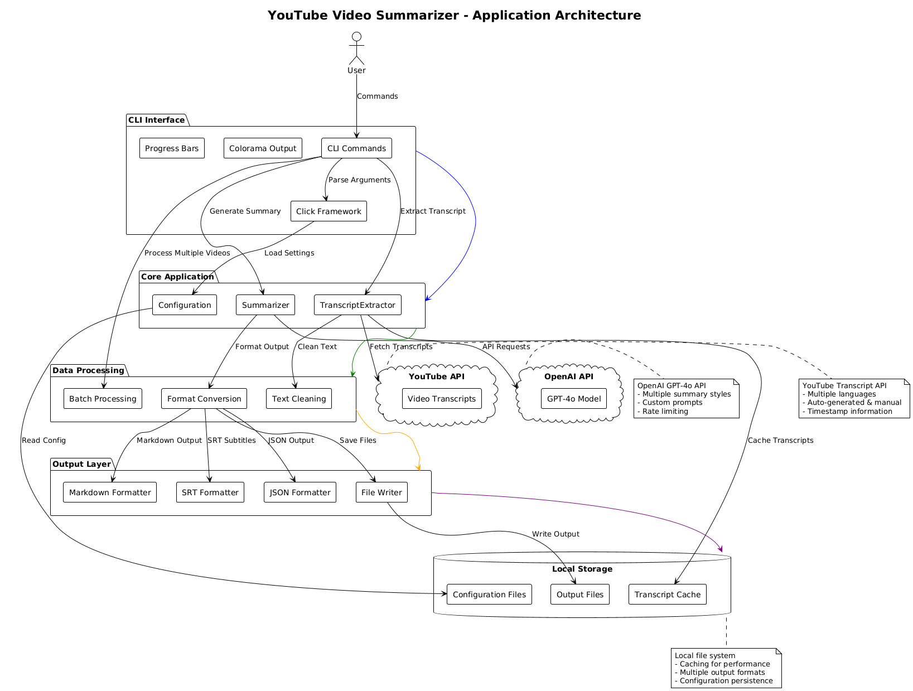
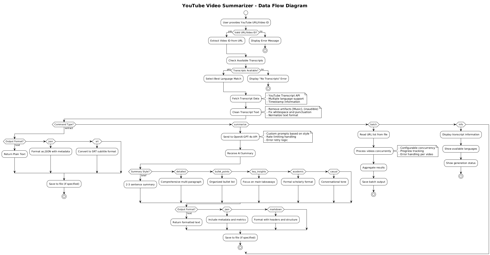
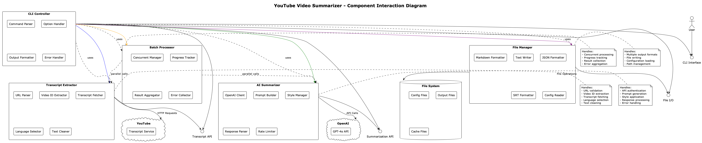

# YouTube Video Summarizer

A powerful command-line tool that extracts transcripts from YouTube videos and generates intelligent summaries using OpenAI's GPT-4o API.

## Features

- 🎥 **Extract transcripts** from YouTube videos in multiple languages
- 🤖 **AI-powered summarization** using GPT-4o with multiple style options
- 📝 **Multiple output formats** (text, JSON, markdown, SRT)
- 🔄 **Batch processing** for multiple videos
- 🌍 **Multi-language support** with automatic fallback
- ⚡ **Fast and efficient** with progress indicators
- 🎨 **Colorful CLI** with comprehensive help and error handling
- 🧪 **Fully tested** with pytest coverage

## Diagram Files

### 1. Architecture Diagram (`architecture.puml`)

**Purpose**: Shows the overall system architecture and component relationships.


### 2. Data Flow Diagram (`data_flow.puml`)

**Purpose**: Illustrates the complete data processing pipeline from user input to final output.


### 3. Component Interaction Diagram (`component_diagram.puml`)

**Purpose**: Details the internal component interactions and interfaces.


# [More UML documentation here at](https://plantuml.com)

- The UML diagram was created with a plugin called "PlanUML" which is a free for PyCharm or intelliJ

## Installation

### Prerequisites

- Python 3.8 or higher
- [uv](https://docs.astral.sh/uv/) - Modern Python package manager
- OpenAI API key

### Quick Install with uv (Recommended)

```bash
# Install uv if you haven't already
curl -LsSf https://astral.sh/uv/install.sh | sh

# Clone the repository
git clone <repository-url>
cd youtube_summarizer

# Create virtual environment and install dependencies
uv venv
source .venv/bin/activate  # On Windows: .venv\Scripts\activate

# Install production dependencies
uv pip install -r requirements.txt

# Set up environment variables
cp .env.example .env
# Edit .env and add your OpenAI API key
```

### Development Install with uv

```bash
# Create development environment
uv venv --python 3.11
source .venv/bin/activate

# Install all dependencies including dev tools
uv pip install -r requirements.txt
uv pip install pytest pytest-cov pytest-mock black flake8 mypy

# Or install in editable mode
uv pip install -e ".[dev]"
```

### Alternative: Traditional pip Install

```bash
# Clone the repository
git clone <repository-url>
cd youtube_summarizer

# Create virtual environment
python -m venv .venv
source .venv/bin/activate  # On Windows: .venv\Scripts\activate

# Install dependencies
pip install -r requirements.txt

# Set up environment variables
cp .env.example .env
# Edit .env and add your OpenAI API key
```

## Configuration

### Environment Variables

The application uses environment variables for configuration. Create a `.env` file in the project root:

```bash
# Copy the example file
cp .env.example .env
```

#### Required Environment Variables

| Variable         | Description                      | Example       | Required |
| ---------------- | -------------------------------- | ------------- | -------- |
| `OPENAI_API_KEY` | OpenAI API key for GPT-4o access | `sk-proj-...` | ✅ Yes   |

#### Optional Environment Variables

| Variable                       | Description                 | Default                     | Example                     |
| ------------------------------ | --------------------------- | --------------------------- | --------------------------- |
| `OPENAI_API_BASE`              | Custom OpenAI API base URL  | `https://api.openai.com/v1` | `https://api.openai.com/v1` |
| `OPENAI_MODEL`                 | Default model to use        | `gpt-4o`                    | `gpt-4o-mini`               |
| `YT_SUMMARIZER_LOG_LEVEL`      | Logging level               | `INFO`                      | `DEBUG`                     |
| `YT_SUMMARIZER_MAX_CONCURRENT` | Default concurrent requests | `3`                         | `5`                         |
| `YT_SUMMARIZER_DEFAULT_STYLE`  | Default summary style       | `detailed`                  | `brief`                     |

#### Production Environment Variables

For production deployments, also consider:

| Variable                    | Description                       | Example            |
| --------------------------- | --------------------------------- | ------------------ |
| `YT_SUMMARIZER_CACHE_DIR`   | Directory for caching transcripts | `/tmp/yt_cache`    |
| `YT_SUMMARIZER_OUTPUT_DIR`  | Default output directory          | `/app/output`      |
| `YT_SUMMARIZER_CONFIG_FILE` | Path to config file               | `/app/config.yaml` |

### Environment Setup Examples

#### Development (.env file)

```bash
# OpenAI Configuration
OPENAI_API_KEY=sk-proj-your-development-key-here
OPENAI_MODEL=gpt-4o
OPENAI_API_BASE=https://api.openai.com/v1

# Application Settings
YT_SUMMARIZER_LOG_LEVEL=DEBUG
YT_SUMMARIZER_MAX_CONCURRENT=2
YT_SUMMARIZER_DEFAULT_STYLE=detailed

# Optional: Custom directories
YT_SUMMARIZER_CACHE_DIR=./cache
YT_SUMMARIZER_OUTPUT_DIR=./output
```

#### Production (.env file)

```bash
# OpenAI Configuration
OPENAI_API_KEY=sk-proj-your-production-key-here
OPENAI_MODEL=gpt-4o
OPENAI_API_BASE=https://api.openai.com/v1

# Application Settings
YT_SUMMARIZER_LOG_LEVEL=INFO
YT_SUMMARIZER_MAX_CONCURRENT=5
YT_SUMMARIZER_DEFAULT_STYLE=detailed

# Production directories
YT_SUMMARIZER_CACHE_DIR=/app/cache
YT_SUMMARIZER_OUTPUT_DIR=/app/output
YT_SUMMARIZER_CONFIG_FILE=/app/config.yaml
```

#### Docker Environment

```bash
# For Docker deployments
OPENAI_API_KEY=sk-proj-your-docker-key-here
OPENAI_MODEL=gpt-4o
YT_SUMMARIZER_LOG_LEVEL=INFO
YT_SUMMARIZER_CACHE_DIR=/app/cache
YT_SUMMARIZER_OUTPUT_DIR=/app/output
```

#### CI/CD Environment

```bash
# For automated testing and deployment
OPENAI_API_KEY=sk-proj-your-ci-key-here
OPENAI_MODEL=gpt-4o-mini  # Use cheaper model for testing
YT_SUMMARIZER_LOG_LEVEL=ERROR
YT_SUMMARIZER_MAX_CONCURRENT=1  # Avoid rate limits
```

### API Key Setup

#### 1. Get OpenAI API Key

1. Visit [OpenAI Platform](https://platform.openai.com/api-keys)
2. Sign in or create an account
3. Navigate to "API Keys" section
4. Click "Create new secret key"
5. Copy the key (starts with `sk-proj-` or `sk-`)

#### 2. Set Environment Variable

**Option A: Using .env file (Recommended)**

```bash
echo "OPENAI_API_KEY=your-api-key-here" >> .env
```

**Option B: Export in shell**

```bash
export OPENAI_API_KEY="your-api-key-here"
```

**Option C: Set in shell profile**

```bash
# Add to ~/.bashrc, ~/.zshrc, or ~/.profile
echo 'export OPENAI_API_KEY="your-api-key-here"' >> ~/.bashrc
source ~/.bashrc
```

**Option D: Pass as command argument**

```bash
./yt-summarizer --api-key "your-api-key-here" summarize VIDEO_ID
```

### Configuration Validation

Test your configuration:

```bash
# Check if API key is set
./yt-summarizer config-info

# Test API connection
./yt-summarizer summarize "dQw4w9WgXcQ" --style brief
```

### Security Best Practices

1. **Never commit API keys to version control**

   - Add `.env` to `.gitignore`
   - Use `.env.example` for templates

2. **Use different keys for different environments**

   - Development key for local testing
   - Production key for live deployment
   - CI/CD key with limited usage

3. **Rotate keys regularly**

   - Set up key rotation schedule
   - Monitor usage in OpenAI dashboard

4. **Limit key permissions**

   - Use project-specific keys when possible
   - Set usage limits and alerts

5. **Secure key storage**
   - Use environment variables, not config files
   - Consider using secret management services

## Architecture

### System Overview

The YouTube Video Summarizer follows a modular architecture with clear separation of concerns:

```
┌─────────────────┐    ┌──────────────────┐    ┌─────────────────┐
│   CLI Layer     │    │   Core Logic     │    │  External APIs  │
│                 │    │                  │    │                 │
│ • Click Framework│───▶│ • TranscriptExtractor│───▶│ • YouTube API   │
│ • Colorama      │    │ • Summarizer     │    │ • OpenAI GPT-4o │
│ • Progress Bars │    │ • BatchProcessor │    │                 │
└─────────────────┘    └──────────────────┘    └─────────────────┘
         │                       │                       │
         ▼                       ▼                       ▼
┌─────────────────┐    ┌──────────────────┐    ┌─────────────────┐
│  Output Layer   │    │ Data Processing  │    │ Local Storage   │
│                 │    │                  │    │                 │
│ • Text Format   │    │ • Text Cleaning  │    │ • Config Files  │
│ • JSON Format   │    │ • Format Convert │    │ • Output Files  │
│ • Markdown      │    │ • Validation     │    │ • Cache Data    │
│ • SRT Subtitles │    │                  │    │                 │
└─────────────────┘    └──────────────────┘    └─────────────────┘
```

### Component Diagrams

The application includes comprehensive PlantUML diagrams in the `diagrams/` folder:

#### 1. Architecture Diagram (`diagrams/architecture.puml`)

Shows the overall system architecture, component relationships, and external dependencies.

#### 2. Data Flow Diagram (`diagrams/data_flow.puml`)

Illustrates the complete data processing pipeline from user input to final output.

#### 3. Component Interaction Diagram (`diagrams/component_diagram.puml`)

Details the internal component interactions and interfaces.

### Generating Diagram Images

To generate PNG images from the PlantUML source files:

```bash
# Using manus-render-diagram utility (if available)
manus-render-diagram diagrams/architecture.puml diagrams/architecture.png

# Or using PlantUML directly
java -jar plantuml.jar diagrams/*.puml

# Or using online PlantUML server
# Copy the .puml content to: http://www.plantuml.com/plantuml/uml/
```

### Key Components

#### CLI Layer (`src/cli.py`)

- **Command Parser**: Handles user commands and arguments
- **Option Handler**: Processes CLI flags and options
- **Output Formatter**: Formats results for display
- **Error Handler**: Manages error reporting and logging

#### Core Logic

- **TranscriptExtractor** (`src/transcript_extractor.py`): YouTube transcript extraction
- **Summarizer** (`src/summarizer.py`): OpenAI GPT-4o integration
- **BatchProcessor**: Concurrent processing of multiple videos

#### Data Processing

- **Text Cleaning**: Removes artifacts and normalizes text
- **Format Conversion**: Handles multiple output formats
- **Validation**: Input validation and error checking

#### External Integrations

- **YouTube Transcript API**: Fetches video transcripts
- **OpenAI GPT-4o API**: Generates intelligent summaries
- **File System**: Local storage and configuration

### Data Flow

1. **Input Processing**: User provides YouTube URL or video ID
2. **Video ID Extraction**: Parse and validate video identifier
3. **Transcript Fetching**: Retrieve transcript from YouTube API
4. **Text Processing**: Clean and normalize transcript text
5. **AI Summarization**: Generate summary using GPT-4o (if requested)
6. **Output Formatting**: Format results in requested format
7. **File Output**: Save results to file system (optional)

### Error Handling

The application implements comprehensive error handling:

- **Input Validation**: URL format and video ID validation
- **API Error Handling**: Graceful handling of API failures
- **Rate Limiting**: Automatic retry with exponential backoff
- **Fallback Mechanisms**: Language fallback for transcripts
- **User-Friendly Messages**: Clear error reporting

### Performance Considerations

- **Concurrent Processing**: Batch operations use configurable concurrency
- **Caching**: Transcript caching to avoid repeated API calls
- **Rate Limiting**: Respects API rate limits and quotas
- **Memory Management**: Efficient handling of large transcripts
- **Progress Tracking**: Real-time progress indicators for long operations

## Usage

The tool provides a Cobra-style CLI with multiple commands and comprehensive options.

### Basic Commands

#### Summarize a Video

```bash
# Basic summarization
./yt-summarizer summarize https://youtube.com/watch?v=VIDEO_ID

# With specific style
./yt-summarizer summarize VIDEO_ID --style brief

# Save to file
./yt-summarizer summarize VIDEO_ID --output summary.txt

# JSON format with custom length
./yt-summarizer summarize VIDEO_ID --format json --max-length 100
```

#### Extract Transcript

```bash
# Basic transcript extraction
./yt-summarizer extract https://youtube.com/watch?v=VIDEO_ID

# With timestamps
./yt-summarizer extract VIDEO_ID --timestamps

# Save as SRT file
./yt-summarizer extract VIDEO_ID --format srt --output subtitles.srt

# Specific language preference
./yt-summarizer extract VIDEO_ID --language en --language es
```

#### Get Video Information

```bash
# Check available transcripts
./yt-summarizer info VIDEO_ID
```

#### Batch Processing

```bash
# Process multiple videos from file
./yt-summarizer batch urls.txt --style detailed

# Save to directory
./yt-summarizer batch urls.txt --output-dir summaries/ --format markdown

# Concurrent processing
./yt-summarizer batch urls.txt --concurrent 5
```

### Summary Styles

- `brief` - Concise 2-3 sentence summary
- `detailed` - Comprehensive summary with key points
- `bullet_points` - Organized bullet point format
- `key_insights` - Focus on main insights and takeaways
- `academic` - Formal academic-style summary
- `casual` - Conversational, easy-to-read format

### Output Formats

- `text` - Plain text (default)
- `json` - Structured JSON with metadata
- `markdown` - Formatted markdown
- `srt` - Subtitle format (extract command only)

### Advanced Options

```bash
# Verbose output
./yt-summarizer --verbose summarize VIDEO_ID

# Quiet mode (errors only)
./yt-summarizer --quiet batch urls.txt

# Custom model
./yt-summarizer --model gpt-4 summarize VIDEO_ID

# Custom prompt
./yt-summarizer summarize VIDEO_ID --custom-prompt "Summarize focusing on technical details"

# Save transcript separately
./yt-summarizer summarize VIDEO_ID --save-transcript transcript.txt
```

### Configuration Info

```bash
# Check current configuration
./yt-summarizer config-info
```

## Examples

### Example 1: Quick Summary

```bash
./yt-summarizer summarize "https://youtube.com/watch?v=dQw4w9WgXcQ" --style brief
```

### Example 2: Detailed Analysis

```bash
./yt-summarizer summarize dQw4w9WgXcQ \
  --style detailed \
  --format markdown \
  --output analysis.md \
  --save-transcript transcript.txt
```

### Example 3: Batch Processing

Create `videos.txt`:

```
https://youtube.com/watch?v=VIDEO1
https://youtube.com/watch?v=VIDEO2
VIDEO3
```

Run batch processing:

```bash
./yt-summarizer batch videos.txt \
  --style key_insights \
  --output-dir summaries \
  --format json \
  --concurrent 3
```

### Example 4: Multi-language Support

```bash
# Prefer Spanish, fallback to English
./yt-summarizer extract VIDEO_ID --language es --language en --timestamps
```

## File Formats

### Input File for Batch Processing

Create a text file with one YouTube URL or video ID per line:

```
https://youtube.com/watch?v=VIDEO1
https://youtu.be/VIDEO2
VIDEO3
https://youtube.com/watch?v=VIDEO4&t=30s
```

### JSON Output Format

```json
{
  "video_id": "dQw4w9WgXcQ",
  "style": "detailed",
  "summary": "This video is about...",
  "transcript_length": 1250,
  "summary_length": 180
}
```

### SRT Output Format

```
1
00:00:00,000 --> 00:00:02,500
Welcome to this video

2
00:00:02,500 --> 00:00:05,500
Today we will learn about Python
```

## Development

### Running Tests

```bash
# Run all tests
python -m pytest

# Run with coverage
python -m pytest --cov=src --cov-report=html

# Run specific test file
python -m pytest tests/test_transcript_extractor.py -v

# Run only unit tests
python -m pytest -m unit
```

### Code Quality

```bash
# Format code
black src/ tests/

# Lint code
flake8 src/ tests/

# Type checking
mypy src/
```

### Project Structure

```
youtube_summarizer/
├── src/
│   ├── __init__.py
│   ├── cli.py                 # Command-line interface
│   ├── transcript_extractor.py # YouTube transcript extraction
│   └── summarizer.py          # GPT-4o summarization
├── tests/
│   ├── __init__.py
│   ├── test_cli.py
│   ├── test_transcript_extractor.py
│   └── test_summarizer.py
├── docs/                      # Documentation
├── yt-summarizer             # Main executable
├── requirements.txt          # Dependencies
├── setup.py                  # Package setup
├── pytest.ini               # Test configuration
├── .env.example             # Environment template
└── README.md               # This file
```

## API Reference

### TranscriptExtractor

```python
from src.transcript_extractor import TranscriptExtractor

extractor = TranscriptExtractor()

# Extract video ID from URL
video_id = extractor.extract_video_id(url)

# Get available transcripts
transcripts = extractor.get_available_transcripts(video_id)

# Extract transcript
transcript = extractor.extract_transcript(video_id, ['en', 'es'])

# Get transcript with timestamps
timestamped = extractor.get_transcript_with_timestamps(video_id)
```

### Summarizer

```python
from src.summarizer import Summarizer, SummaryStyle

summarizer = Summarizer(api_key="your-key")

# Basic summarization
summary = summarizer.summarize(transcript, SummaryStyle.DETAILED)

# With custom options
summary = summarizer.summarize(
    transcript,
    style=SummaryStyle.BRIEF,
    max_length=100,
    custom_prompt="Focus on technical aspects"
)

# Extract key topics
topics = summarizer.extract_key_topics(transcript, num_topics=5)

# Summarize with questions
result = summarizer.summarize_with_questions(transcript)
```

## Troubleshooting

### Common Issues

1. **API Key Error**

   ```
   Error: OpenAI API key is required
   ```

   Solution: Set the `OPENAI_API_KEY` environment variable

2. **No Transcript Available**

   ```
   Error: Failed to extract transcript
   ```

   Solution: Check if the video has captions enabled or try a different video

3. **Rate Limiting**

   ```
   Error: Rate limit exceeded
   ```

   Solution: Reduce concurrent requests or wait before retrying

4. **Import Errors**
   ```
   ImportError: No module named 'youtube_transcript_api'
   ```
   Solution: Install dependencies with `pip install -r requirements.txt`

### Debug Mode

Enable verbose logging for troubleshooting:

```bash
./yt-summarizer --verbose summarize VIDEO_ID
```

### Getting Help

```bash
# General help
./yt-summarizer --help

# Command-specific help
./yt-summarizer summarize --help
./yt-summarizer extract --help
./yt-summarizer batch --help
```

## Contributing

1. Fork the repository
2. Create a feature branch
3. Make your changes
4. Add tests for new functionality
5. Run the test suite
6. Submit a pull request

## License

This project is licensed under the MIT License. See the LICENSE file for details.

## Changelog

### v1.0.0

- Initial release
- YouTube transcript extraction
- GPT-4o summarization
- Multiple output formats
- Batch processing
- Comprehensive CLI
- Full test coverage

## Acknowledgments

- [youtube-transcript-api](https://github.com/jdepoix/youtube-transcript-api) for transcript extraction
- [OpenAI](https://openai.com/) for GPT-4o API
- [Click](https://click.palletsprojects.com/) for CLI framework
- [pytest](https://pytest.org/) for testing framework
